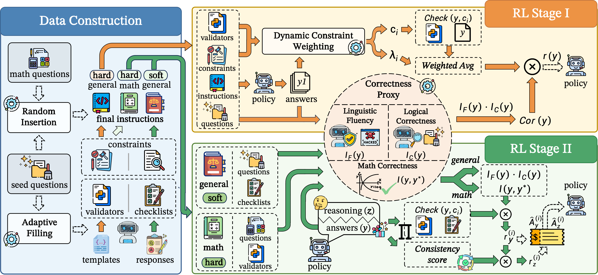
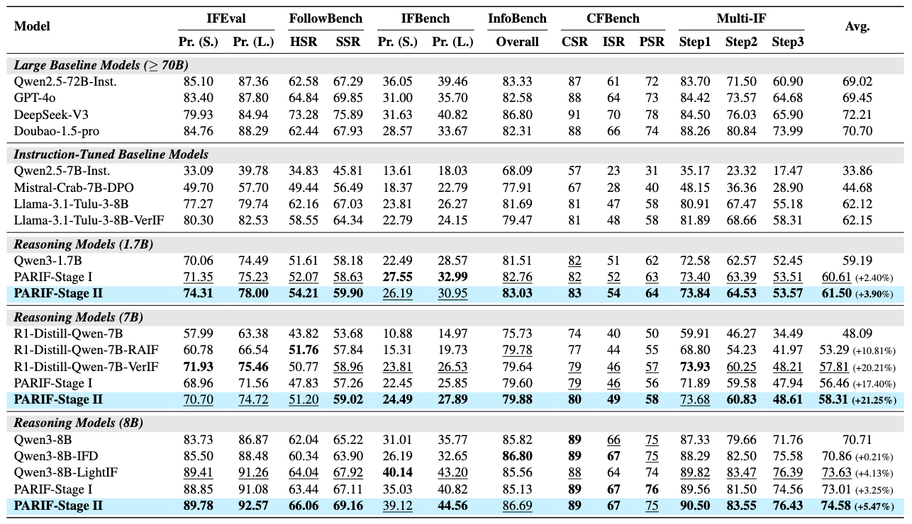
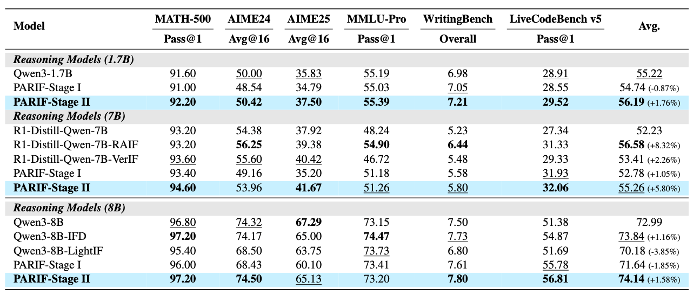

<h1 align="center" style="margin-top: 10px; width: 85%; margin-left: auto; margin-right: auto;">
  PARIF: Pushing the Pareto Frontier of Instruction Following and Reasoning with Curriculum Reinforcement Learning
</h1>

<p align="center">
  Rongchuan Mu<sup>1*</sup>,
  Zexin Wang<sup>1*</sup>,
  Qianyu Wang<sup>1*</sup>,
  Minghua Ma<sup>1</sup>,
  Zekun Wang<sup>1</sup>,
  Ming Liu<sup>1,2</sup>,
  Bing Qin<sup>1,2</sup>
  <br>
  <sup>1</sup>Harbin Institute of Technology, Harbin, China &nbsp;&nbsp;
  <sup>2</sup>Pengcheng Laboratory, Shenzhen, China
  <br>
</p>

<div align="center"> 

[]()
[](https://huggingface.co/parif2026)

</div>

## 🔥 News

* **[2026.04]** Our paper is accepted by **ACL 2026 Main Conference**!
* **[2026.04]** We release our models on Hugging Face.

---

## 💡 Overview

PARIF is a two-stage curriculum reinforcement learning framework designed to push the Pareto frontier of instruction following and general reasoning. As illustrated in our framework pipeline, the workflow consists of three main components:

* **Data Construction:** We synthesize a high-quality dataset by integrating constraints into seed and math questions using adaptive filling and random insertion strategies, accompanied by corresponding automated validators.
* **RL Stage I:** Focuses on optimizing the model's reasoning paradigm. It employs **Dynamic Constraint Weighting** to overcome optimization bottlenecks and introduces a **Correctness Proxy** (evaluating linguistic fluency and logical correctness) to mitigate reward hacking.
* **RL Stage II:** Builds upon Stage I to enhance the logical consistency between the reasoning process and the final answers. By calculating a **Consistency Score**, this stage enables the decoupled optimization of both components via our Decoupled-GRPO algorithm.
<p align="center">
  
  <i>
  The PARIF framework.
  </i>
</p>
---

## 🚀 Quick Start

*(Installation and usage instructions will be updated soon.)*

---

## 📊 Main Results

<p align="center">
  
  <i>
  Main results (%) on IF benchmarks.
  </i>
</p>

### 2. General Reasoning Capabilities
<p align="center">
  
  <i>
  Main results (%) on general benchmark.
  </i>
</p>


## 📚 Citation

If you find our work helpful, please cite our paper:

```bibtex
@inproceedings{mu2026parif,
  title={PARIF: Pushing the Pareto Frontier of Instruction Following and Reasoning with Curriculum Reinforcement Learning},
  author={Mu, Rongchuan and Wang, Zexin and Wang, Qianyu and Ma, Minghua and Wang, Zekun and Liu, Ming and Qin, Bing},
  booktitle={Proceedings of the Annual Meeting of the Association for Computational Linguistics},
  year={2026}
}
